# DongYoung-Kim


## 소개

소프트웨어학과 20학번 **백엔드** 파트 김동영의 레포지토리입니다.

## 과제

week6 standard 과제 사진
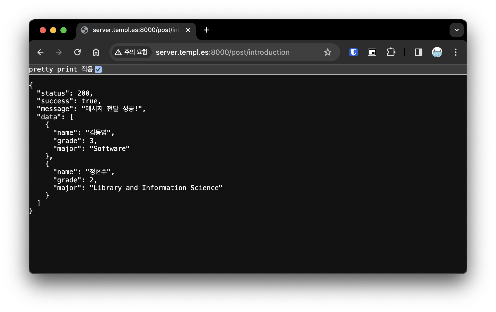
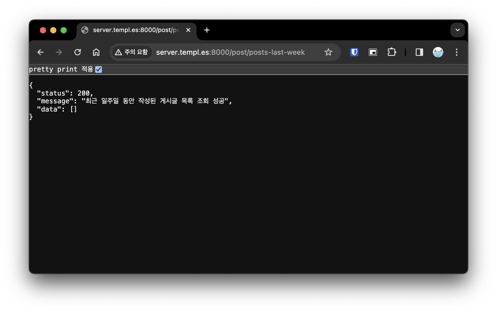
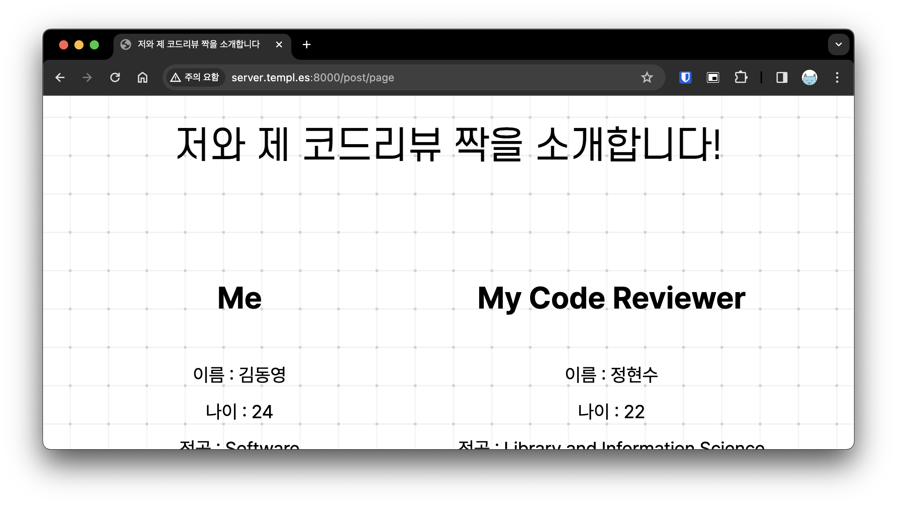
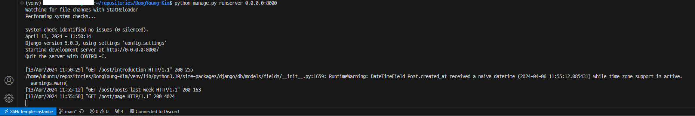
설명 : AWS 과금 이슈로 개인 ubuntu 서버에서 과제 수행함

<details>
  <summary>week5</summary>
  <div markdown="1">
    week5 standard 과제 사진
    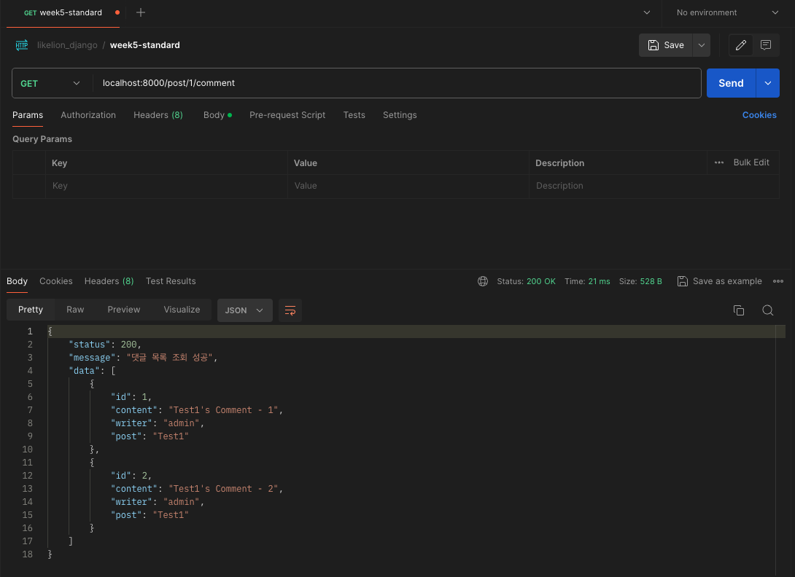
    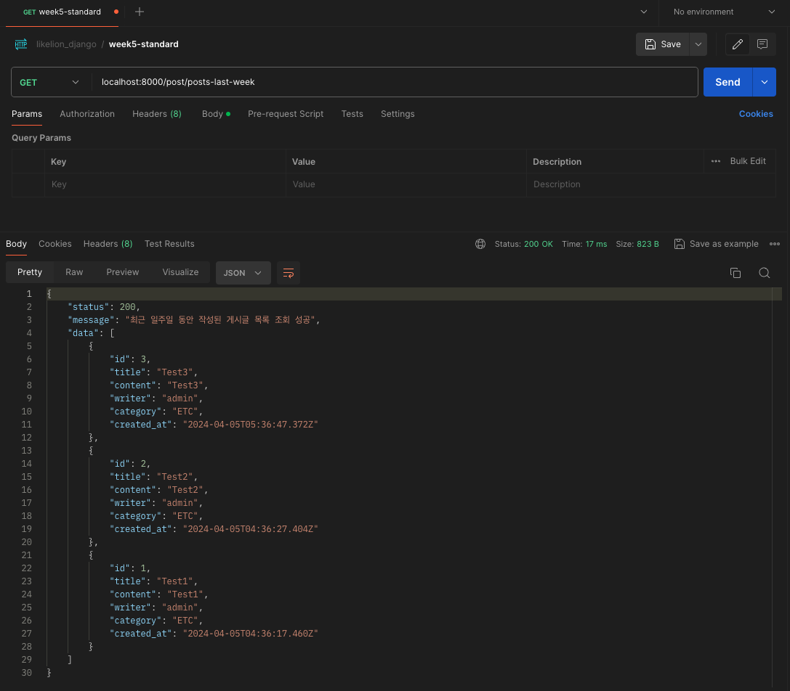
    week5 challenge 과제 사진
  </div>
</details>

<details>
  <summary>week4</summary>
  <div markdown="1">
    week4 standard 과제 사진
    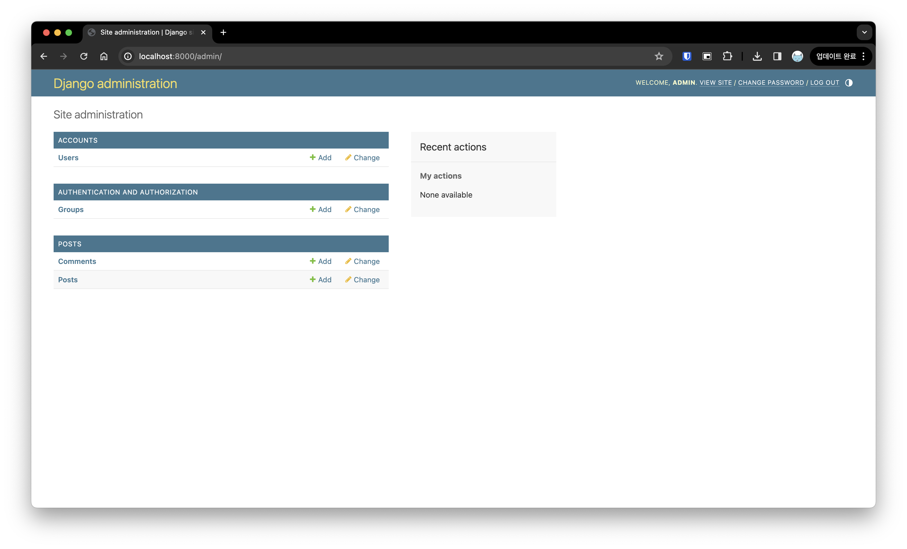
    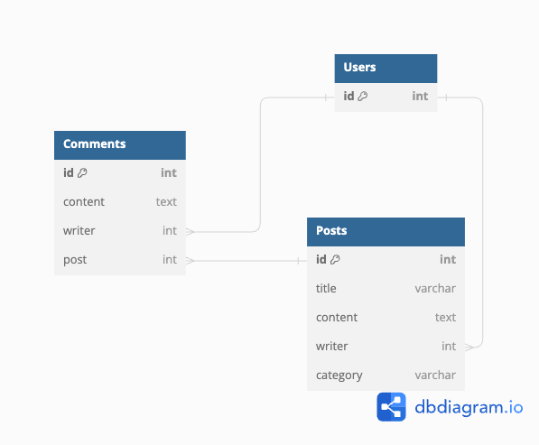
    week4 challenge 과제 사진
    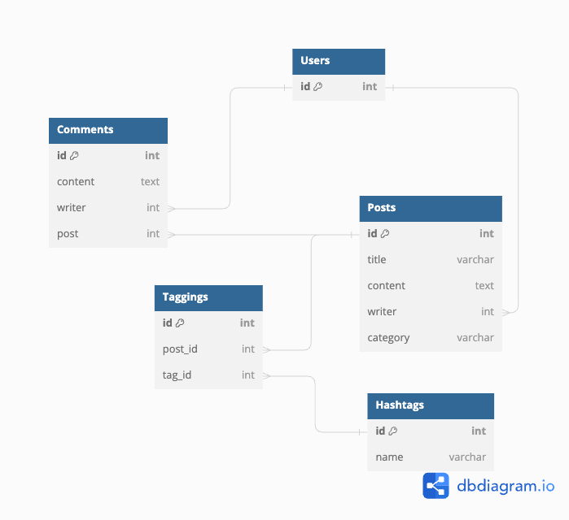
    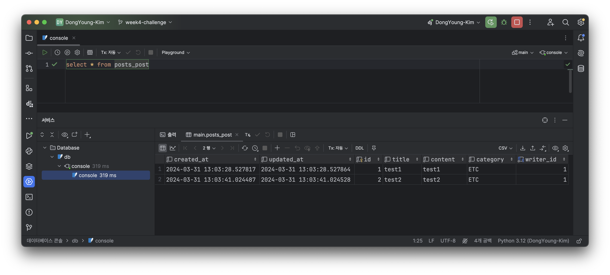
    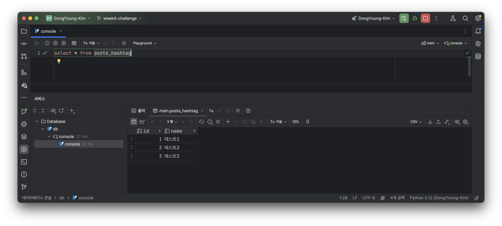
    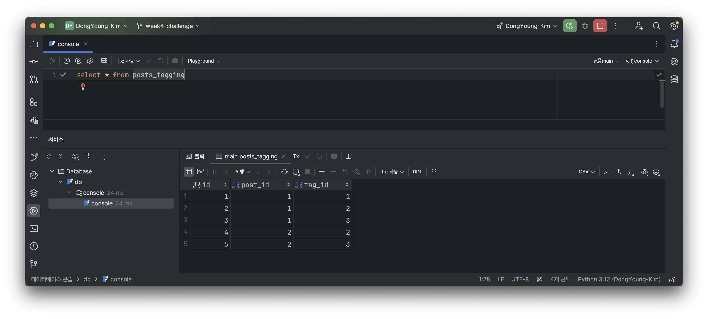
    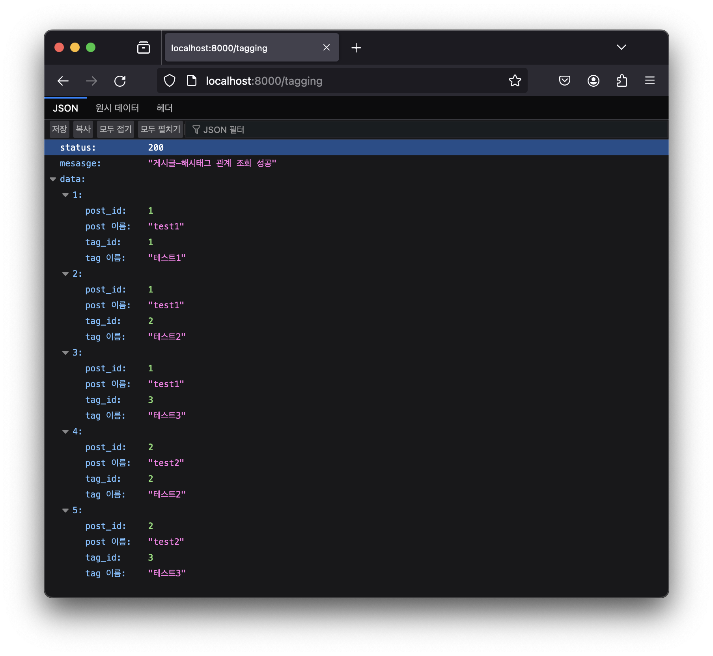
  </div>
</details>

<details>
  <summary>week3</summary>
  <div markdown="1">
    week3 standard 과제 사진
    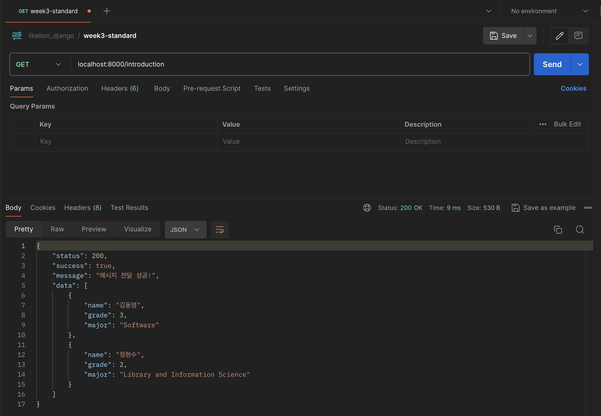
    week3 challenge 과제 사진
    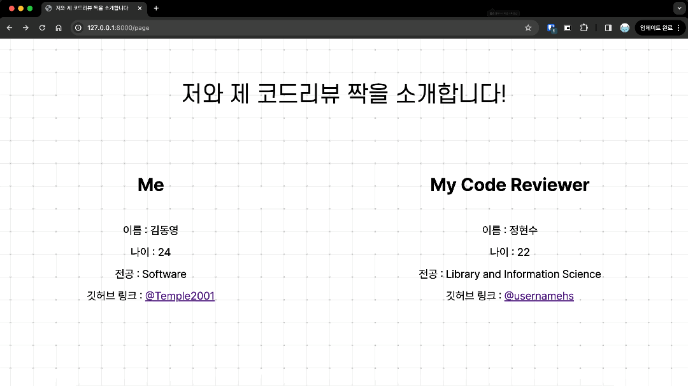
  </div>
</details>

<br/>

> [!CAUTION]
> 이 레포지토리는 작성자가 판단한 결과 정말 아무런 내용도 담고 있지 않습니다.
> 빨리 이 페이지를 나가서 의미있고 유익한 시간을 보내세요.

```
Δ~~~Δ
ξ ･ェ･ξ
ξ　~　ξ
ξ　　 ξ
ξ　　 “~～~～O
ξ　　　　　　 ξ
ξ ξ ξ~～~ξ ξ　
ξ_ξ_ξ　ξ_ξ_ξ


```

> [!IMPORTANT]
> 아직도 안 나갔어요? 진짜 아무것도 없다니까요.

```
A____A
|・ㅅ・  |
|っ　ｃ|
|　　　|
|　　　|
|　　　|
|　　　|
|　　　|
U￣￣U


```

멋사 화이팅!! 👍👍👍
