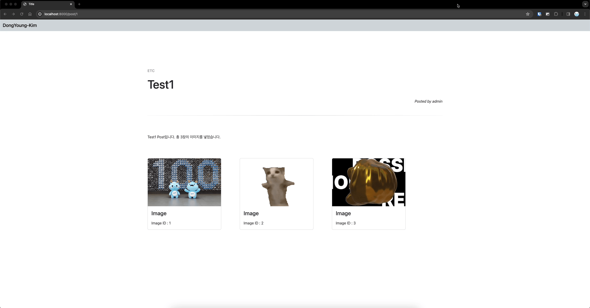

# DongYoung-Kim

## 소개

소프트웨어학과 20학번 **백엔드** 파트 김동영의 레포지토리입니다.

## 과제

week5 standard 과제 사진

week5 challenge 과제 사진

  
week4

  

    week4 standard 과제 사진
    
    
    week4 challenge 과제 사진
    
    
    
    
    
  

  
week3

  

    week3 standard 과제 사진
    
    week3 challenge 과제 사진
    
  

 

> [!IMPORTANT]
> 멋사 화이팅!!

